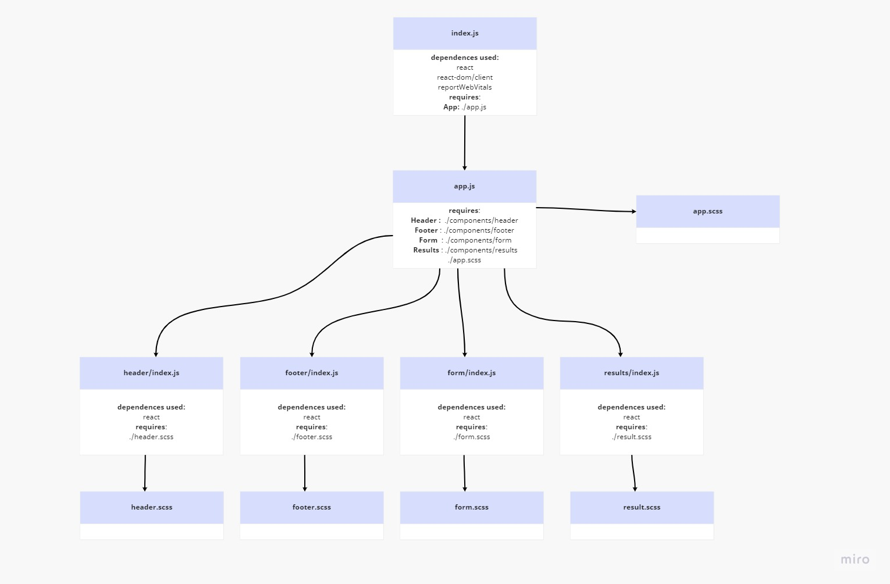

# Resty

## Lab Requirements

Students will be creating and styling a Counter application. Look for the following attributes

- `Header`, `Footer`, and `Counter` components to separate files
- Properly `export` them as defaults
- Import them into the `App` Component using ES6 `import` statement
- Proper state management
- Button Handlers
  - Bonus if they can wire both buttons with one handler

### Grading Standards & Notes

- Features
  - As noted
- Code Quality
  - Looking for proper class syntax.
  - Good file naming and folder structure.
  - Styles well written, using SASS variables/nesting and thought through beyond simple colors.
- Testing
  - Not Required
- Deployment
  - Code Sandbox only.
- Documentation
  - Quality README

### Lab Assistance Notes

- The first and most important part of the lab assignment is to draw a process diagram of the starter code and state as events happen. Once the students understand that, they can move on.

### Setup

```js
git clone 
cd resty
npm install
```

### initialize

```js
npm start
```
## UML Diagram :

<br>



## NOTE : Please use this url for testing 

```
https://reqres.in/api/posts
```

## [Code Sandbox Link Lab 26](https://codesandbox.io/s/summer-silence-dnfdpo?file=/src/app.js)

## [Code Sandbox Link Lab 27](https://codesandbox.io/s/heuristic-mccarthy-tfk1qu)

<!-- ## [Code Sandbox Link Lab 28](https://codesandbox.io/s/gifted-forest-tkhn5e) -->
